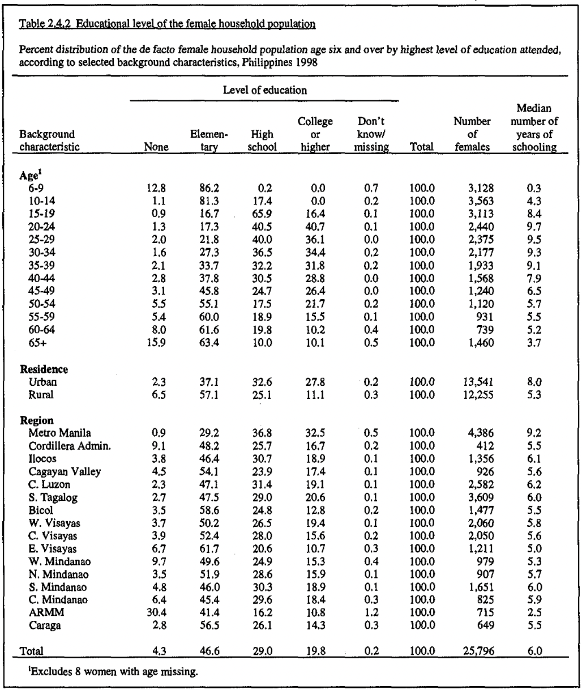

```{r, echo=FALSE, warning=FALSE}
# install.packages('rnaturalearth')
# install.packages('sf')
#install.packages("devtools")
#devtools::install_github("ropensci/rnaturalearthhires") 
#tinytex::install_tinytex()
#install.packages("ggpubr")
#install.packages('janitor')
#install.packages('pdftools')
#install.packages('purrr')
#install.packages('tidyverse')
#install.packages('stringi')
#install.packages('ggplot2')
#install.packages("pointblank")
#tinytex::reinstall_tinytex()

# install.packages("leaflet")
# install.packages("ggmap")
# install.packages("leaflet.extras")
# install.packages("htmltools")
# install.packages("maps")
# install.packages("mapproj")
# install.packages("mapdata")

```

```{r, echo=FALSE, warning=FALSE, message=FALSE}
library(janitor)
library(pdftools)
library(purrr)
library(tidyverse)
library(stringi)
library(ggplot2)
library(ggpubr)
library(pointblank)

library(leaflet)
library(tidyverse)
library(ggmap)
library(leaflet.extras)
library(htmltools)
library(maps)
library(mapproj)
library(mapdata)

setwd("/Users/meixuanchen/Desktop/Women-and-Girls-Education-The-Unequal-Balance/inputs/data")
all_content <- pdf_text("FR103.pdf")
just_page_i <- stri_split_lines(all_content[[38]])[[1]]

just_page_i <- just_page_i[just_page_i != ""]  # Here we delete the empty lines

just_page_i_no_header <- just_page_i[9:length(just_page_i)]
just_page_i_no_header_no_footer <- just_page_i_no_header[1:35]

data <- tibble(all = just_page_i_no_header_no_footer)
data <- data %>% 
  mutate(all = str_squish(all)) %>% 
  mutate(all = str_replace(all, "Age1", "Age")) %>%
  mutate(all = str_replace(all, "1120.0", "100.0")) %>%
  mutate(all = str_replace(all, "Metro Manila", "Metro_Manila")) %>%
  mutate(all = str_replace(all, "Cordillera Admin", "Cordillera_Admin")) %>%
  mutate(all = str_replace(all, "Cagayan Valley", "Cagayan_Valley")) %>%
  mutate(all = str_replace(all, "C. Luzon", "C_Luzon")) %>%
  mutate(all = str_replace(all, "S. Tagalog", "S_Tagalog")) %>%
  mutate(all = str_replace(all, "W. Visayas", "W_Visayas")) %>%
  mutate(all = str_replace(all, "C. Visayas", "C_Visayas")) %>%
  mutate(all = str_replace(all, "E. Visayas", "E_Visayas")) %>%
  mutate(all = str_replace(all, "W. Mindanao", "W_Mindanao")) %>%
  mutate(all = str_replace(all, "N. Mindanao", "N_Mindanao")) %>%
  mutate(all = str_replace(all, "S. Mindanao", "S_Mindanao")) %>% 
  mutate(all = str_replace(all, "C. Miedanan", "C_Mindanao")) %>%
  mutate(all = str_replace(all, "25r796", "25,796")) %>%
  mutate(all = str_replace(all, "4,5", "4.5")) %>%
  mutate(all = str_replace(all, "54,1", "54.1")) %>%
  mutate(all = str_replace(all, "23,9", "23.9")) %>%
  mutate(all = str_replace(all, "17,4", "17.4")) %>%
  mutate(all = str_replace(all, "0,1", "0.1")) %>%
  mutate(all = str_replace(all, "100,0", "100.0")) %>%
  mutate(all = str_replace(all, "5,6", "5.6")) %>%
  separate(col = all,
           into = c("background", "none", "elementary", "high_school", "college", "missing", "total", "females","med_yrs"),
           sep = " ", 
           remove = TRUE,
           fill = "right",
           extra = "drop")

write_csv(data, "raw_data.csv") 

raw_data <- read_csv("raw_data.csv")

data_with_age <- just_page_i_no_header_no_footer[2:14]
data_with_residence <- just_page_i_no_header_no_footer[16:17]
data_with_region <- just_page_i_no_header_no_footer[19:35]


demography_data_age <- tibble(all = data_with_age) %>% 
  mutate(all = str_replace(all, "1120.0", "100.0")) %>%
  mutate(all = str_squish(all)) %>% separate(col = all,
           into = c("background", "none", "elementary", "high_school", "college", "missing", "total", "females","med_yrs"),
           sep = " ", 
           remove = TRUE,
           fill = "right",
           extra = "drop") 

demography_data_residence <- tibble(all = data_with_residence) %>% mutate(all = str_squish(all)) %>% separate(col = all,
           into = c("background", "none", "elementary", "high_school", "college", "missing", "total", "females","med_yrs"),
           sep = " ", 
           remove = TRUE,
           fill = "right",
           extra = "drop")

demography_data_region <- tibble(all = data_with_region) %>% 
  mutate(all = str_replace(all, "Metro Manila", "Metro_Manila")) %>%
  mutate(all = str_replace(all, "Cordillera Admin", "Cordillera_Admin")) %>%
  mutate(all = str_replace(all, "Cagayan Valley", "Cagayan_Valley")) %>%
  mutate(all = str_replace(all, "C. Luzon", "C_Luzon")) %>%
  mutate(all = str_replace(all, "S. Tagalog", "S_Tagalog")) %>%
  mutate(all = str_replace(all, "W. Visayas", "W_Visayas")) %>%
  mutate(all = str_replace(all, "C. Visayas", "C_Visayas")) %>%
  mutate(all = str_replace(all, "E. Visayas", "E_Visayas")) %>%
  mutate(all = str_replace(all, "W. Mindanao", "W_Mindanao")) %>%
  mutate(all = str_replace(all, "N. Mindanao", "N_Mindanao")) %>%
  mutate(all = str_replace(all, "S. Mindanao", "S_Mindanao")) %>% 
  mutate(all = str_replace(all, "C. Miedanan", "C_Mindanao")) %>%
  mutate(all = str_replace(all, "25r796", "25,796")) %>%
  mutate(all = str_replace(all, "4,5", "4.5")) %>%
  mutate(all = str_replace(all, "54,1", "54.1")) %>%
  mutate(all = str_replace(all, "23,9", "23.9")) %>%
  mutate(all = str_replace(all, "17,4", "17.4")) %>%
  mutate(all = str_replace(all, "0,1", "0.1")) %>%
  mutate(all = str_replace(all, "100,0", "100.0")) %>%
  mutate(all = str_replace(all, "5,6", "5.6")) %>%
  mutate(all = str_squish(all)) %>% separate(col = all,
           into = c("background", "none", "elementary", "high_school", "college", "missing", "total", "females","med_yrs"),
           sep = " ", 
           remove = TRUE,
           fill = "right",
           extra = "drop") 
```

```{r, echo=FALSE}
# data cleaning
demography_data_age<- demography_data_age %>%
  filter(!is.na(background) & !is.na( none) & !is.na( high_school) & !is.na(college) & !is.na(missing)& !is.na(total)  & !is.na( females) & !is.na(med_yrs)) %>% 
  mutate_all(~str_remove_all(.,",")) %>% 
  mutate(char = "age") %>%
  select("background", "none", "elementary", "high_school", "college", "missing", "total", "females","med_yrs","char") 
   

demography_data_residence <- demography_data_residence %>%
  filter(!is.na(background) & !is.na( none)  & !is.na( high_school) & !is.na(college) & !is.na(missing)& !is.na(total)  & !is.na( females) & !is.na(med_yrs)) %>% 
  mutate_all(~str_remove_all(.,",")) %>%
  mutate(char = "residence") %>%
  select("background", "none", "elementary", "high_school", "college", "missing", "total", "females","med_yrs","char") 
   

demography_data_region <- demography_data_region %>%
  filter(!is.na(background) & !is.na( none)  & !is.na( high_school) & !is.na(college) & !is.na(missing)& !is.na(total)  & !is.na( females) & !is.na(med_yrs)) %>% 
  mutate_all(~str_remove_all(.,",")) %>% 
  mutate(char = "region") %>%
  select("background", "none", "elementary", "high_school", "college", "missing", "total", "females","med_yrs","char") 

clean <-rbind(demography_data_age,demography_data_residence,demography_data_region)


agent <-
  create_agent(tbl = clean) %>%
  col_is_character(columns = vars(background, character)) %>%
  col_is_numeric(columns = vars(none, elementary, high_school, college, missing, total, females,med_yrs)) %>% interrogate()

#agent
# By removing #, you are able to see the results of pointblank. 

write_csv(clean, "cleaned_data.csv")

```

\newpage
# Introduction

Investing in girls’ education transforms communities, countries and the entire world. Women' education is not just about women going to school, but also about ensuring that girls learn and feel safe in school; Opportunities to complete education at all levels and acquire the knowledge and contribute to their communities and the world(@citeB). Based on estimates of UNESCO, 129 million girls around the world are out of school, which includes 32  million of primary school age, and 97 million of secondary school age(@citeC). Currently, only 49% of the world's countries have achieved gender equality in primary education. At the secondary level, the gap widens:42 per cent of countries have achieved gender equality in junior secondary education and 24 per cent in senior secondary education. There are many barriers to girls' education, such as poverty, child marriage and gender-based violence. Poor families tend to favor boys when they invest in education. In some places, schools do not meet girls' safety, hygiene or sanitation needs. In other countries, teaching practices do not promote gender equality and create gender gaps in learning and skills development. Women are affected by poverty in different ways, depending upon their age, region, citizenship, etc. Poverty is one of the most important factors in determining whether a girl can obtain and complete an education. 
\newline

The data was collected from early March to early May 1998 by the National Statistics Office collaborating with the Department of Health (DOH). Philippines National Demographic and Health Survey (NDHS) had a sample size of 13,983 women who were 15 to 49 years old and provided information from background characteristics to the maternal mortality of Filipinos. 
\newline

Filipino families attach great importance to education. The Philippine Constitution reflects this and provides that education, at least up to the high school level, is a fundamental right of all Filipino children. The findings show that the vast majority of the population does have a formal education. Only 4 per cent of the population aged six and over had no formal education, while no more than 3 per cent of those aged 10 to 50 had no schooling. About half of men and women had only attended primary school, more than a quarter had attended high school and a fifth had advanced education. In terms of education, no significant gender differences were observed. However, there are significant differences in education levels between urban and rural areas. The education system seems to favour residents of urban areas.
\newline

This paper discusses poverty and its implications for girl's education in Philippines. It focuses on gender as a social construct that differentiates the impact of poverty. The paper focuses upon three factors and their relationship with education level of women: age, region and residence, to analyze the education level of female Filipinos who are older than age 6 in 1998.  Factors were chosen in consideration of literature and also what studies have repeatedly highlighted to be affecting the level of education in real life: low family income, living in remote or underserved areas, having a disability, or belonging to a minority language group, are the most backward in accessing and completing education. Through analysis of the interaction of the three factors, the paper examines aspects of national and global policy processes and educational disparities in society. It integrates micro-level descriptions of schooling with accounts of impacts of region and residence with wider social influences in relation to the education of girls in the Philippines.
\newline

The remainder of the paper is split into five sections. Section 2 explains the data source and collection methodology, potential bias and ethics issues, as well as our selected data’s characteristics. Section 3 describes the data simulation and the comparison between simulated and original data. Section 4 presents the findings from our methodology investigating the relationship between female's education and the various factors. Section 5 discusses what the findings
results imply the weaknesses and limitations in interpreting the findings of the paper, as well as next steps to enhance and expand on the findings of the report. The last section is the appendix that presents the supplements figures and table.

\newpage
# Data
## Data Source

This paper uses the Educational level of the female household [@citeD] obtained from the 1998 Philippines National Demographic and Health Survey(NDHS). The dataset was collected by downloading the final report of the 1998 NDHS published in the National Demographic and Health Surveys (NDHS) program. 
\newline

R studio [@citeR]is used to process the code and complete the analysis.The package 'pdftools' [@citepdftools] is used to download and read the content into R by parsing the pdf. The package 'stringi' [@citestringi] and 'tidyverse' [@citetidyverse] are then used to gather the data. The package 'janitor' [@citejanitor] is used for cleaning the data and making a new dataframe. The package 'purrr' is used to generate, clean the data[@citepurrr].
\newline

The package 'leaflet' [@citeleaflet], 'leaflet.extras' [@citeleafletextra] are used to generate the map of Philippines.
The package 'htmltools' [@citehtmltools], 'maps' [@citemaps], 'mapdata' [@citemapdata] and 'mapproj' [@citemapproj] are used to download the map package from the websites and generate the map data.The package 'ggmap' [@citeggmap] is to generate the figure for Philippine map. 
\newline

The package 'ggplot' [@citeggplot2] is used for making the figures and graphs for the analysis. The package 'ggpubr' [@citeggpubr], 'reshape' [@citereshape] and 'devtools' [@citedevtools] are also used for making better figures and graphs for the analysis. 


## Methodology

The 1998 Demographic and Health Survey was a national-level survey. It is a nationally representative survey of 13,983 women aged 15-49 in the Philippines. This report summarizes the findings of the 1998 National Demographic and Health Survey (NDHS). It was undertaken by the National Statistics Office in collaboration with the Department of Health (DOH), the University of the Philippines Population Institute, and other concerned agencies in the Philippine government. The 1998 NDHS is part of the worldwide Demographic and Health Surveys (DHS) program. It was designed to collect, analyze, and disseminate demographic data on fertility, family planning, and maternal and child health. The 1998 NDHS was conducted from early March to early
May 1998.
\newline

The main objective of the National Demographic and Health Survey is to provide up-to-date information on fertility levels; Determinants of fertility; Fertility preference; Infant and child mortality rates; Knowledge, approval and use of family planning methods; Breastfeeding practices; And maternal and child health care. The information is intended to assist policy makers and program managers in assessing and designing programs and strategies to improve health and family planning services in the country.
\newline

The aim of the 1998 NDHS is to provide each of the 16 regions of the country with accurate and acceptable estimates of socio-demographic characteristics such as fertility, family planning use, health and mortality indicators. The sample design for the National Demographic and Health Survey consisted of approximately 12,500 households selected from 755 census areas (EAs) and was expected to conduct complete interviews with approximately 15,000 women aged 15-49. Samples are first allocated to each region. Within each region, a self-weighted sampling scheme was used; However, due to the non-proportional distribution of samples across regions, the NDHS samples were not self-weighted at the country level and weighted factors were applied to the data.
\newline

The 1998 NDHS used three types of questionnaires: the Household questionnaire (NDHS Table 1), the individual questionnaire (NDHS Table 2) and the health module (NDHS Table 3). The content of the first two questionnaires is based on the DEMOGRAPHIC and Health Survey Model A questionnaire, which is designed for countries with high contraceptive use. These questionnaire models were adapted for use in the Philippines in a series of meetings with representatives from the Department of Health, the National Federation of Producers and Producers, the Population and Communications Commission, the National Population Research Institute and others. The draft questionnaire was then distributed to other interested parties. The questionnaires were written in English and translated into the six most common dialects, namely Tagalog, Cebu, Ilokano, Bico, Hiligaynon, and Waray.
\newline

The NDHS was pre-tested in October 1997. Female interviewers were trained at the NSO central office in Manila, after which they conducted interviews at various locations in the field under the observation of staff in NSO. A total of about 160 family, women and health questionnaires were completed. The wording and translation of the questionnaire were revised based on observations in the field and recommendations made by the pre-test field team.
\newline

The review and editing of the NDHS is carried out by field editors in the inventory area to facilitate verification of the forms. Editors expect to review questionnaires from at least eight families a day. The supervisor of a group of four or more participants assisted in editing and reviewing the questionnaire
\newline

Of the families interviewed, 14,390 women were identified as eligible for individual interviews (i.e., 15-49 years of age) and interviews were conducted with 13,983 or 97% of them. The main reason qualified women did not respond was that, despite repeated visits, they could not be found at home. Visa rejection rates are low.
\newline

This was a part of the worldwide Demographic and Health Surveys (DHS) programme, and the GDHS was composed of 3 parts: the Household's questionnaire, the Woman's questionnaire and the Man's questionnaire. All the questionnaires were modified to account for the situation in Philippines.
\newline

By using 'mutate' and 'filter' functions, we deleted unhelpful space, signs like '.',',' and corrected some of the wrong characters to generate a new cleaned dataset. 
We created a new variable 'char' in the cleaned dataset. By identifying the background provided in the original table, we split the 'char' into three different types: age, region, residence.

\newpage
## Data Description

The glimpse of the final dataset that we cleaned is shown in Table \@ref(tab:table) below.

```{r table,echo=FALSE,message =FALSE, results='asis'}
#install.packages("kableExtra")
library(kableExtra)
library(knitr)
kable(clean[1:5,], caption = "Clean Dataset") %>%
  kable_styling(font_size = 7, full_width = T,position = "center", latex_options = "HOLD_position")
```

As Table \@ref(tab:table) shown, there are 10 variables that are:
\newline

- background: which are age groups, residence and region. Age groups are separated into 13 groups in a five year interval from age 6 to 65+ as the table shown. There are two residence that are urban and rural. Region is separated into 16 groups. 
\newline

- none: The percentage of the participants in that background have none of the education background.
- elementary: The percentage of the participants in that background have elementary school degree as their highest level of education.
\newline

- high_school: The percentage of the participants in that background have high school degree as their highest level of education.
\newline

- college: The percentage of the participants in that background have college degree or higher as their highest level of education.
\newline

- missing:The percentage of the participants in that background  missing or don't know their highest education level. 
\newline

- total: The total percentage of the participant, it is always shown as 100%.
\newline

- females: Numbers of female participant in that background. 
\newline

- med_yrs: The median years of the schooling of particpants in that background. 
\newline

- char: The characters of the background. It is shown as 'age', 'residence' or 'region'. This is the new variable that we constructed by function 'mutate'.

\newpage
## Strengths

The questionnaires were made available in the six major local languages (Tagalog, Cebu, Ilokano, Bico, Hiligaynon, and Waray), making the survey accessible to a larger population. Female interviewers were
trained at the NSO central office in Manila, after which they conducted interviews, which ensures the engagement of participants. Before the actual survey, a test was conducted, and adjusted the questionnaire was based on the feedback from the test. These questions are comprehensive and detailed in order to gather information on the socio-economic situation of the family.

## Weaknesses

Depending on classification, there are around 120 to 175 languages spoken in the Philippines(@citeE). Since there are only six local languages in the questionnaire, if the selected families are ethnic minorities who only know their own language, it will be difficult for the interviewees to understand and answer the survey. Visitors who have previously spent a night in a chosen home are eligible to be interviewed. Visitors may come from different regions, so the target sample size for each region may be skewed.

\newpage
## Key Features


```{r, echo=FALSE}
# Number of females in age groups, region, residence
demography_data_age$background = factor(demography_data_age$background, levels = c("6-9","10-14","15-19","20-24","25-29","30-34","35-39","40-44","45-49","50-54","55-59","60-64","65+"))
```

Figure \@ref(fig:1)A presents the number of females in different age groups. We notice that the number of younger women is much higher than the number of middle-aged or elder women, so we can infer that there seems to be more young labor force in Philippines. Unlike many developing countries, the Philippines has not been affected by the population aging issues. In fact, the birth rate in the Philippines is relatively high as the demographic structure of the country has changed dramatically in recent decades. We also identified that there are even 3,563 women in the 10-14 age group, which is about five times as many as the number of women in the 60-64 age group.

```{r 1, echo=FALSE,fig.cap="Number of Female vs. Region and Residence"}
reorder_size <- function(x) {
  factor(x, levels = names(sort(table(x))))
}

a1<-demography_data_age %>%
  ggplot(aes(x=background,y=as.numeric(females)))+geom_bar(stat = "identity", color = "black", fill = "sky blue")+xlab ("Age Group") +ylab("Number of Female") +ggtitle("Number of Female in Different Age Group")+theme(axis.text.x = element_text(angle = 45), title =element_text(size=8))


#a2 <- demography_data_region_1 %>%
#  ggplot(aes(x=region,y=as.numeric(number_of_females)))+geom_bar(stat = "identity", color = "black",fill = "burlywood")+theme(axis.text.x = element_text(angle = 45)) + xlab("Region")+ylab("Number of Female")+ggtitle("Number of Female in Different Regions")

a3 <- demography_data_residence%>%
  ggplot(aes(x=background,y=as.numeric(females)))+geom_bar(stat = "identity",color = "black", fill = "sky blue")+xlab("Residence")+ylab("Number of Female")+ggtitle("Number of Female in Different Residences")+theme(title =element_text(size=8))

plot <- ggarrange(a1,a3, labels = c("A","B"), ncol = 2, nrow = 1, widths = 1)
plot

```

We can compare the discrepancy between the quantity of women in urban and rural areas in Figure \@ref(fig:1)B. There are 13541 women living in urban areas. The number of women living in rural areas is 12,255, whereas we find that the number of women living in urban areas is slightly greater than that of women living in rural areas. However, we know that in Philippines, the percentage of the population living in rural areas is larger and if we consider the ratio of men to women as 1:1, it is expected to be more women living in rural areas rather than in the urban areas. The data here reflects that females prefer to live in cities.

\newpage
```{r 2,echo=FALSE, fig.cap="Number of Female vs. Region and Percent of Total Female vs. Education Level"}
demography_data_region_1 <- demography_data_region[-17,]
q1<- demography_data_region_1 %>%
  ggplot(aes(x=background,y=as.numeric(females)))+geom_bar(stat = "identity", color = "black",fill = "sky blue")+theme(axis.text.x = element_text(angle = 45)) + xlab("Region")+ylab("Number of Female")+ggtitle("A. Number of Female in Different Regions")+ theme( plot.title = element_text(size = 9), axis.title.y = element_text(size = 7), axis.text.x = element_text(size = 7)) 

#pie chart

data <- data.frame(
  `Education Level`=c("none","elementary","high school", "collage or higher", "missing"),
  value=c(4.3,46.6,29.0,19.8,0.2)
)

# Basic piechart
q2 <- ggplot(data, aes(x="", y=value, fill= Education.Level)) +
  geom_bar(stat="identity", width=1) + xlab("% of Total Female") +ylab("Education Level")+ggtitle("B. Percentage of Total Female vs. Education Level")+coord_polar("y", start=0) + theme(legend.text=element_text(size=7),legend.title = element_text(size = 6), plot.title = element_text(size = 9), axis.title.y = element_text(size = 7)) 

plot9 <- ggarrange(q1,q2)
plot9
```
 
Figure \@ref(fig:2)A indicates the number of females in the different regions and we found that there are more females in Metro_Manila and S_Tagalog while there are less females in Caraga and Cordillera_Admin. This is related to the fact that the population densities differ between regions. Metro_Manila and S_Tagalog are more well developed regions, there are more work opportunities available for residents, so more people are concentrated there, Caraga and Cordillera_Admin are less developed regions with less population density, which are not that attractive for labor force. Moreover, we have discussed that women prefer to live in urban areas rather than in rural areas. The combination of these factors leads to the variation in the number of women in the different regions.
\newline
Figure \@ref(fig:2)B depicts the percentage of women in the different education levels among the total females. We found that the greatest proportion of women had only completed elementary education, accounting for approximately 46.6% of all women. Less than 20 percent of women have received advanced education (college or higher). This indicates that the average education level of the females is still relatively low. However, we observe that only 4.3% of women are uneducated, indicating that most women are still aware of the importance of education and choose to pursue it.
\newpage

```{r 3, message=FALSE, echo = FALSE, warning=FALSE, fig.cap="Philippines administrative regions"}
 w <- map_data('world', region = 'Philippines')
ggplot(w,aes(x=long,y=lat,group = group, fill=subregion)) + ggtitle("B. Philippines administrative regions")+
  geom_polygon(color = 'Black') +
  coord_map('polyconic')+ theme(legend.text=element_text(size=7), legend.title = element_text(size = 7),legend.key.size = unit(0.5,'cm') , plot.title = element_text(size = 9), axis.title.y = element_text(size = 7)) 
```

Figure \@ref(fig:3) is a map illustrates not only the general geographical distribution of Philippines, but also a more detailed administrative division of the country. However, in our table, we do not have such a detailed classification of regional segments, we have combined some smaller administrative zones and finally divided the Philippine national territory into 16 regions, which are Metro Manila, Cordillera Admin, linens, Cagayan Valley, C. Luzon, S. Tagalog, Bicol, W. Visayas, C. Visayas, E. Visayas. Tagalog, Bicol, W. Visayas, C. Visayas, E. Visayas, W. Mindanao, N. Mindanao, S. Mindanao, C. Mindanao, ARMM, and Caraga. The population of the Philippines is quite unevenly distributed due to regional development disparities. The central plains are densely populated and dominant in both economic and political aspects. Metro Manila, where the capital is located, has a high population density of 9317 persons per square kilometer. However, in less well-developed areas, such as some provinces on the northern part of Luzon, the population density is just a few dozen people per square kilometer. The Philippines has a relatively balanced urban-rural population, with a slightly larger rural population than urban population. Approximately 52.3 percent of the Filipino residents live in rural areas.

\newpage
# Simulated Data 
```{r, echo=FALSE}
n <- 25796
set.seed(03)
x_age_group <- sample(1:13 ,size = n,replace = TRUE, prob = c(1/13,1/13,1/13,1/13,1/13,1/13,1/13,1/13,1/13,1/13,1/13,1/13,1/13))

n <-  25796
set.seed(03)
x_residence <- sample(1:2,size = n,replace = TRUE, prob = c(1/2,1/2))

a <- data.frame(x_residence) %>%
  mutate(x_residence = case_when(
    x_residence == 1 ~ "Urban",
    x_residence == 2 ~ "Rural"
  ))


n <-  25796
set.seed(03)
x_region <- sample(1:16,size = n,replace = TRUE, prob = c(1/16,1/16,1/16,1/16,1/16,1/16,1/16,1/16,1/16,1/16,1/16,1/16,1/16,1/16,1/16,1/16))


n <-  25796
set.seed(03)
x_education_level <- sample(1:5,size = n,replace = TRUE, prob = c(0.25,0.25,0.25,0.25,0))


```

```{r 4, echo=FALSE, fig.cap="Simulation vs. Origin Data"}
par(mfrow=c(2,2))

plot(table(x_age_group)/n,lwd=10,ylim=c(0,0.2),xlab="age group",ylab="Density", cex.axis = 0.5,cex.lab = 0.5)
lines(c(3128/25796,3563/25796,3113/25796,2440/25796,2375/25796,2177/25796,1933/25796,1568/25796,1240/25796,1120/25796,931/25796,739/25796,1460/25796),lwd=4,type = "h",col="sky blue")
legend("topright",c("Empirical pdf","pdf"),lty = 1,col = c(1,"sky blue"),lwd = c(5,2), cex = 0.5)
title(main = ( "A. Comparison of Simulation vs. Origin Age Group"),  line = 1, cex.main = 0.5)

plot(table(x_residence)/n,lwd=10,ylim=c(0,0.6),xlab="residence",ylab="Density", cex.axis = 0.5, cex.lab = 0.5)
lines(c(13541/25796,12255/25796),lwd=4,type = "h",col="sky blue")
legend("topright",c("Empirical pdf","pdf"),lty = 1,col = c(1,"sky blue"),lwd = c(5,2), cex = 0.5)
title(main = ( "B. Comparison of Simulated vs. Origin Residence"),  line = 1, cex.main = 0.5)

plot(table(x_region)/n,lwd=10,ylim=c(0,0.2),xlab="region",ylab="Density", cex.axis = 0.5, cex.lab = 0.5)
lines(c(4386/25796,412/25796,1356/25796,926/25796,2582/25796,3609/25796,1477/25796,2060/25796,2050/25796,1211/25796,979/25796,907/25796,1651/25796,825/25796,715/25796,649/25796),lwd=4,type = "h",col="sky blue")
legend("topright",c("Empirical pdf","pdf"),lty = 1,col = c(1,"sky blue"),lwd = c(5,2), cex = 0.5)
title(main = ( "C. Comparison of Simulation vs. Origin Region"),  line = 1, cex.main = 0.5)

plot(table(x_education_level)/n,lwd=10,ylim=c(0,0.6),xlab="education level",ylab="Density", cex.axis=0.5, cex.lab = 0.5)
lines(c(0.043,0.466,0.29,0.198,0.0026),lwd=4,type = "h",col="sky blue")
legend("topright",c("Empirical pdf","pdf"),lty = 1,col = c(1,"sky blue"),lwd = c(5,2), cex = 0.5)
title(main = ( "D. Comparison of Simulation vs. Origin Education level"),  line = 1, cex.main = 0.5)


```

The above figures show the results of our simulation. Figure \@ref(fig:4)A compared the real proportion distribution of females at each age group appearing in our table and the simulated pencentage. Based on our observation of the age groups in the original table, we found that all females were divided into 13 different age groups, but it was remarkable that the population size of each age group was not quite the same. In order to compare the differences in population proportions of different age groups, we performed a simulation. Our simulation was based on the default that the population of each age group is the same, and we found that the results of the simulation differed significantly from the proportion of the population in different age groups as reflected in the original table. The actual proportion of females in the first six age groups is noticeably higher than that in the simulation, indicating a higher number of young people, while the proportion of females in the age groups over 35 is much lower than the simulation results, demonstrating the smaller number of middle-aged and older people among the survey respondents. 
\newline
We consider that this may be related to the demographic distribution of the population at different age stages, as the birth rate in the Philippines has been very high in recent decades, and the birth wave from the 1970s to the 1990s led to a population spike between the ages of 6 and 19. We therefore detected a considerable proportion of females in the 6-19 year old range among respondents of the survey.
\newline
We can view the different proportions of rural and urban households after simulation in Figure \@ref(fig:4)B. By default, the urban and rural populations are relatively balanced in the simulation, and we simulate the population's residence at a ratio of 1:1, comparing the results with the ratio of rural and urban females presented in the table. We find that the results of the simulation are generally close to the proportions shown in the table.
However, the actual proportion of urban population is slightly higher than the theoretical value, and the percentage of rural population as a whole is comparatively lower. Through the comparison of the urban and rural population ratios, we were aware that the urban and rural populations in the Philippines are not fully balanced and this country should continue to move towards de-urbanization.
\newline
Figure \@ref(fig:4)C and 4D are still simulated according to the model we mentioned above for the percentage of population in different regions and the proportion of population with different levels of education. We find that the population of Metro_Manila and S_Tagalog regions is much higher than the average, and the population density of these two regions is extremely high. In contrast, the population of Cordillera Admin and Caraga is much lower, which is presented by the lower proportion in the table than that in our simulation. Ignoring the case of don't know or missing in the simulation of the education level, we estimated the percentage of the population in the four observable education levels, where we found that the number of people with only elementary education was much higher than what we have predicted, and the actual proportion of females who did not go to school was obviously smaller than that in the simulation. The fraction of respondents who received high school and college education or higher is basically consistent with our simulation results. This suggests that the majority of the population tends to be educated and that the government has succeeded in convincing many people who would not been educated to go to school.

```{r, echo=FALSE}
#generate the dataset for the simulation data 
df_simulation <- data.frame(Education = x_education_level, Age_group = x_age_group, Residence = x_residence, Region = x_region)
#clean the simulation dataset
#clean the education level variable
df_simulation_clean <- df_simulation
df_simulation_clean$Education[df_simulation$Education == '1'] <- 'None'
df_simulation_clean$Education[df_simulation$Education == '2'] <- 'Elementary'
df_simulation_clean$Education[df_simulation$Education == '3'] <- 'High School'
df_simulation_clean$Education[df_simulation$Education == '4'] <- 'College/higher'
df_simulation_clean$Education[df_simulation$Education == '5'] <- 'Missing'

#clean the age group variable
df_simulation_clean$Age_group[df_simulation$Age_group == '1'] <- '6-9'
df_simulation_clean$Age_group[df_simulation$Age_group == '2'] <- '10-14'
df_simulation_clean$Age_group[df_simulation$Age_group == '3'] <- '15-19'
df_simulation_clean$Age_group[df_simulation$Age_group == '4'] <- '20-24'
df_simulation_clean$Age_group[df_simulation$Age_group == '5'] <- '25-29'
df_simulation_clean$Age_group[df_simulation$Age_group == '6'] <- '30-34'
df_simulation_clean$Age_group[df_simulation$Age_group == '7'] <- '35-39'
df_simulation_clean$Age_group[df_simulation$Age_group == '8'] <- '40-44'
df_simulation_clean$Age_group[df_simulation$Age_group == '9'] <- '45-49'
df_simulation_clean$Age_group[df_simulation$Age_group == '10'] <- '50-54'
df_simulation_clean$Age_group[df_simulation$Age_group == '11'] <- '55-59'
df_simulation_clean$Age_group[df_simulation$Age_group == '12'] <- '60-64'
df_simulation_clean$Age_group[df_simulation$Age_group == '13'] <- '65+'

#clean the residence variable
df_simulation_clean$Residence[df_simulation$Residence == '1'] <- 'Urban'
df_simulation_clean$Residence[df_simulation$Residence == '2'] <- 'Rural'

#clean the region variable
df_simulation_clean$Region[df_simulation$Region == '1'] <- 'MM'
df_simulation_clean$Region[df_simulation$Region == '2'] <- 'CA'
df_simulation_clean$Region[df_simulation$Region == '3'] <- 'Ilocos'
df_simulation_clean$Region[df_simulation$Region == '4'] <- 'CV'
df_simulation_clean$Region[df_simulation$Region == '5'] <- 'CL'
df_simulation_clean$Region[df_simulation$Region == '6'] <- 'ST'
df_simulation_clean$Region[df_simulation$Region == '7'] <- 'Bicol'
df_simulation_clean$Region[df_simulation$Region == '8'] <- 'WV'
df_simulation_clean$Region[df_simulation$Region == '9'] <- 'CV'
df_simulation_clean$Region[df_simulation$Region == '10'] <- 'EV'
df_simulation_clean$Region[df_simulation$Region == '11'] <- 'WM'
df_simulation_clean$Region[df_simulation$Region == '12'] <- 'NM'
df_simulation_clean$Region[df_simulation$Region == '13'] <- 'SM'
df_simulation_clean$Region[df_simulation$Region == '14'] <- 'CM'
df_simulation_clean$Region[df_simulation$Region == '15'] <- 'ARMM'
df_simulation_clean$Region[df_simulation$Region == '16'] <- 'Caraga'


```


\newpage
# Results
## Age vs. Education 

```{r, echo=FALSE}
# make dataset in long format
age_long <- demography_data_age %>% 
#  select(-c(character)) %>% 
  pivot_longer(!background, names_to = "variables", values_to = "percentage") %>% 
  mutate(variables = recode(variables,
                            'none' = "none", 
                            'elementary' = "elementary",
                            'high_school' = 'high school',
                             'college' = 'college',
                             'missing' = 'missing',
                             'total' = 'total',
                             'females' = '#female',
                             'med_yrs' = 'med'))
# create label names list
label_list <- list('none' = "none", 
                   'elementary' = "elementary",
                   'high school' = 'high_school',
                   'college or higher' = 'college',
                   'missing' = 'missing')
labellers <- function(variable, value) {
  return(label_list[value])
}

```

```{r 5,echo=FALSE, message=FALSE, results='hide', fig.cap="Age Groups vs. Median of Schooling Years"}
age_long %>% 
  filter(variables == 'med') %>% 
  ggplot(aes(x = background, 
             y = percentage,
             fill = variables)) +
  geom_bar(stat = 'identity',
           position = 'dodge',color = "black",fill = "sky blue") +
  labs(x = "Age Group",
       y = "Median Edu. Yrs.",
       fill = "Median of Study Years") +
  geom_text(aes(label = percentage), vjust = -0.2)+
  ggtitle("Age vs. Med. Education Yrs.")+
  theme_minimal() +
  scale_fill_brewer() +
  theme(legend.position = "bottom")
```

In Figure \@ref(fig:5), we plot the median number of years of schooling for different age groups. we find that the number of hours of schooling rises with respect to increasing age from 6 to 24 years. In the 6-9 age group, the median number of years of schooling is only 0.3, because most of the people are still preschoolers. However, in the 20-24 age group, we identified that the median number of years of schooling is 9.7, which means that most of the people have completed at least elementary education. However, in the age range of 25 years and above, we found that the length of education did not continue to rise with age. Instead, it showed a decreasing trend, but in the age range of 20-39 years, we found that the median length of education was greater than nine years, we guess this is because when this generation was growing up, the government provided the compulsory education for the public, and as time progressed, the society became more education-oriented. 
\newline
Therefore most people have received at least a fundamental education. When we consider people aged 40 and older, we find that their median length of education is getting shorter, indicating that in previous times, when society was progressing at a slower pace, most people did not pay that much attention to education.

\newpage

```{r 6, echo=FALSE, fig.cap="Age Groups vs. Education Levels"}

# plot bar graph
age_long %>% 
  filter(variables == 'none'|variables == 'elementary'|variables == 'high school'|variables == 'college'|variables == 'missing') %>% 
  ggplot(aes(x = background, 
             y = percentage,
             fill = variables)) +
  geom_bar(stat = 'identity',
           position = 'dodge') +
  coord_flip() +
  labs(x = "Age Group",
       y = "Percent",
       fill = "Education Level") +
  ggtitle("Age vs. Education Level")+
  theme_minimal() +
  scale_fill_brewer() +
  theme(legend.position = "bottom", axis.text.x = element_text(angle = 45, size = 5) )
```

In Figure \@ref(fig:6), we get the distribution of education level at different age groups, we find that most girls are in the stage of receiving elementary education at the age of 6-14 years. In the very wide age range of 20-54 years old, we find that going to college or receiving a higher education is a very popular choice. This indicates that young and middle-aged people in society are aware of the importance of higher education and are enthusiastic about pursuing it. 
\newline
Among people over 35 years old, the number of female who has only attended elementary education increases with the rising age. In the group of people over 65 years old, the percentage of people receiving elementary education even reaches 61.6%, which reflects that in the past era, people did not attach as much significance to education as they did in recent years, although they were aware of the necessity of getting some basic education to cope with life, most of them did not spend much time and efforts on schooling. 
\newline
Furthermore, we noticed that the proportion of people over 60 years old who have no education at all is also higher than that of younger age groups, which confirms what we have mentioned that people in the past did not treat education with sufficient emphasis. We also recognized that this is probably related to the social background of that time, when the Philippine government had not promoted the compulsory education to the public, and the social development was backward, as the agriculture-oriented social industry did not require much educated labor, so people growing up under that background tended to ignore the contribution of education to the whole society.

\newpage
## Residence vs. Education 

```{r, echo=FALSE}
# make dataset in long format
resid_long <- demography_data_residence %>% 
#  select(-c(character)) %>% 
  pivot_longer(!background, names_to = "variables", values_to = "percentage") %>% 
  mutate(variables = recode(variables,
                            'none' = "none", 
                            'elementary' = "elementary",
                            'high_school' = 'high school',
                             'college' = 'college',
                             'missing' = 'missing',
                             'total' = 'total',
                             'females' = '#female',
                             'med_yrs' = 'med'))
# create label names list
label_list <- list('none' = "none", 
                   'elementary' = "elementary",
                   'high school' = 'high_school',
                   'college or higher' = 'college',
                   'missing' = 'missing')
labellers <- function(variable, value) {
  return(label_list[value])
}


```

```{r 7,echo=FALSE, fig.cap= "Residence vs. Median of Schooling Years and Education Level"}
q3 <-resid_long %>% 
  filter(variables == 'med') %>% 
  ggplot(aes(x = background, 
             y = percentage,
             fill = variables)) +
  geom_bar(stat = 'identity',
           position = 'dodge') +
  geom_col(width = 0.5)+
  labs(x = "Residence",
       y = "Median Edu. Yrs.",
       fill = "Median of Study Years") +
  ggtitle("A. Residence vs. Med. Edu. Yrs.")+
   geom_text(aes(label = percentage), vjust = -0.2)+
  theme_minimal() +
  scale_fill_brewer() +
  theme(legend.position = "bottom",legend.key.size = unit(0.5, 'cm'), legend.title = element_text(size = 8), plot.title = element_text(size = 10), axis.title.x = element_text(size = 9), axis.title.y = element_text(size = 9))

reorder_size <- function(x) {
  factor(x, levels = names(sort(table(x))))
}
#ggplot(mpg, aes(reorder_size(class))) 

# plot bar graph
q4<-resid_long %>% 
  filter(variables == 'none'|variables == 'elementary'|variables == 'high school'|variables == 'college'|variables == 'missing')%>%
  ggplot(aes(x = background, 
             y = percentage,
             fill = variables, reorder_size(class))) +
  geom_bar(stat = 'identity',
           position = 'dodge') +
  labs(x = "Residence",
       y = "Percent",
       fill = "Education Level") +
  ggtitle("B. Residence vs. Edu. LVL")+
  theme_minimal() +
  scale_fill_brewer() +
  theme(legend.key.size = unit(0.5, 'cm'), plot.title = element_text(size = 10), axis.title.x = element_text(size = 9), axis.title.y = element_text(size = 9))


plot10 <- ggarrange(q3,q4, widths = c(0.5,1))
plot10
```

In Figure \@ref(fig:7), we compare the median number of years of education obtained by urban and rural residents. We discovered that the median amount of time spent in education for urban residents is 8.0 years, while for rural residents it is only 5.3 years. We detected a significant difference in the median length of education between urban and rural residents. We speculate that this might happen because rural areas are relatively backward, people mostly do not pay sufficient attention to education, or the national fundamental education is not particularly accessible in rural areas. In addition, some women from rural areas with higher education may choose to leave rural areas and live in cities because cities will provide them with more work opportunities and are more compatible with their long-term orientations. This data also reminds us of the significance of improving accessible education in rural areas.
\newline
In Figure \@ref(fig:7)B, we can clearly visualize the proportion distribution of different education levels among rural and urban residents. We find that the percentage of rural population without education is almost three times as high as that of urban population. At the same time, 57.1% of rural women have only received elementary education, while 37.1% of the urban residents attained elementary education as the highest level. The proportion of urban residents with higher education (high school, college or higher) is also much greater than that of rural residents. We can perceive a huge disparity between urban and rural residents in terms of education, with the majority of rural residents having a relatively lower level of education.


\newpage
## Region vs. Education

```{r, echo=FALSE}
# make dataset in long format
region_long <- demography_data_region_1 %>% 
#  select(-c(character)) %>% 
  pivot_longer(!background, names_to = "variables_region", values_to = "percentage") %>% 
  mutate(variables = recode(variables_region,
                            'none' = "none", 
                            'elementary' = "elementary",
                            'high_school' = 'high school',
                             'college' = 'college',
                             'missing' = 'missing',
                             'total' = 'total',
                             'females' = '#female',
                             'med_yrs' = 'med'))
# create label names list
label_list <- list('none' = "none", 
                   'elementary' = "elementary",
                   'high school' = 'high_school',
                   'college or higher' = 'college',
                   'missing' = 'missing')
labellers <- function(variable, value) {
  return(label_list[value])
}
```


```{r 8, echo=FALSE, fig.cap="Region vs. Median of Schooling Years"}
region_long %>% 
  filter(variables == 'med') %>% 
  ggplot(aes(x = background, 
             y = percentage,
             fill = variables)) +
  geom_bar(stat = 'identity',
           position = 'dodge',color = "black",fill = "sky blue") +
  coord_flip() +
  labs(x = "Region",
       y = "Percent",
       fill = "Median of Study Years") +
  geom_text(aes(label = percentage), hjust = -0.2)+
  ggtitle("Region vs. Med. Education Yrs.")+
  theme_minimal() +
  scale_fill_brewer() +
  theme(legend.position = "bottom", axis.text.x = element_text(angle = 90)) 

```

Figure \@ref(fig:8) presents us with the median year of education for females in different regions, and by comparison we find that Metro_Manila, C. Luzon and S. Mindanao have the higher medium value of year of education for females, as we discussed earlier we know that these three regions are more densely populated and economically developed. Therefore, we can conclude that females living in more economically developed regions have higher average duration of education. 
\newline
There seems to be a strong positive relationship between economic development status and education level per capita. In addition to this, we also noticed that in some less populated areas, such as ARMM, E. Visayas, most of the habitants are poorly educated. We also suggest the speculation that in less populated regions, residents live in less stressful lives and the competition between people is less intense, women do not need a high level of education to get a job, while in economically developed regions, life is more stressful and many people are competing for the same position, so people need a high degree of education to get a job.


\newpage
```{r 9, echo=FALSE, fig.cap="Interaction of Region vs. Education Level"}

# plot bar graph
region_long %>% 
  filter(variables == 'none'|variables == 'elementary'|variables == 'high school'|variables == 'college'|variables == 'missing') %>% 
  ggplot(aes(x = background, 
             y = percentage,
             fill = variables)) +
  geom_bar(stat = 'identity',
           position = 'dodge') +
  coord_flip() +
  labs(x = "Region",
       y = "Percent",
       fill = "Education Level") +
  ggtitle("Region vs. Education Level")+
  theme_minimal() +
  scale_fill_brewer() +
  theme(legend.position = "bottom", axis.text.x = element_text(angle = 45, size = 5))

```

Figure 9 exhibits the distribution of the education level of women by regions, and we find that there are enormous differences. Among them, ARMM has the highest percentage of uneducated inhabitants, even reaching a staggering rate of 30.4%. Furthermore, we note that Cordillera Admin, W. Mindanao also have a relatively higher percentage of uneducated residents than the rest of the regions. Additionally, the percentage of residents with high school, college or higher education in these areas is lower than the average for each area. This suggests that the residents of these areas are generally less educated and the majority of the population does not have access to advanced education due to the economic backwardness of these regions.
\newline
We realize that the proportion of residents in Metro Manila with high school education, college and above, remains the highest among all regions, and that only 0.9% of the population in Metro Manila was not educated. This is consistent with our previous observation in Figure \@ref(fig:8)  that residents in Metro Manila received the highest median length of educational attainment across all regions. On the other hand, it reflects the status of Metro Manila as a more advanced province in terms of education and the implementation of government policies for basic education.


\newpage
# Discussion
## Age and Education
The variable age was strongly associated with years of schooling. The frequency of low education was higher in the youngest and oldest group (6-9 and 65+), while high education level predominated in the youngest group (20-24). In this sense, when the sample was divided into several age groups, a significant difference in years of education between groups emerged. 
\newline

Figure \@ref(fig:1) illustrates that 3,563 out of 13,983 of women in Philippines are of age 10-14, which is about five times as many as the number of women in the 60-64 age group. In other words, the birth rate in the Philippines is relatively high with more young labor force. Figure \@ref(fig:5) shows that there are more educated women in the age group 20-24, and this is because most of people at this age have completed elementary education. However, the median of schooling years significantly decreases afterwards, and people aged 50 and older have shorter length of education. This may indicate that in previous times with the society progressing at a slower pace, most people in Philippines did not pay enough attention to women's education or did not have much resources for education.
\newline

As a result of the national education for all policy and the explicit provisions of the 1987 Philippine Constitution, the Philippine school system today is said to be one of the largest in the world(@citeZ). The Congressional Commission on Education Study reports that, as of 1991, there were 16.5 million students enrolled in schools at all levels nationwide. The most recent statistics from the Ministry of Education alone show that the total enrolment in the basic education system was 19,138,635 in the 2000-2001 curriculum year, indicating a dramatic increase in educational demand in the country.
\newline

Additionally, we note from Figure \@ref(fig:6) that the proportion of people over 60 who have no education is also higher than that of the younger group, which supports our argument that education has not been valued sufficiently in the past. We also recognize that this may be related to the background of the society at that time, the Philippine government didn't promote to the public compulsory education, social development lag behind, predominantly agricultural society industry does not need too much education of the workforce, therefore, in this context grew up people tend to overlook the education's contribution to the society as a whole.


## Residence, Region and Education
The school–residence spatial relationship is a key factor in understanding how education level varies. While the Philippines' education system has long been a model for other Southeast Asian countries, it has deteriorated in recent years, especially in more remote and poorer areas(@citeY). Figure \@ref(fig:8) illustrates the indicators on education vary across region. Manila, as the capital and largest city of the Philippines, has a primary school completion rate of nearly 100 percent and median schooling years of 9.2 years, while other parts of the country, residents of Autonomous Region in Muslim Mindanao have the lowest median duration of schooling with only about 30 percent or less and less than half of education level compared with Manila. Not surprisingly, students from urban areas in the Philippines tend to receive higher education with more accessible resources than students from rural areas of the country.
\newline

Geographical attributes play an important role in education level. The education system debate has focused on the amount of financial aid, teacher quality, class size, and school management practices that school districts at different levels of economic development receive. We also recommend that speculation, in densely populated areas, residents living in the tension between people's life and competition is weaker, the women don't need to work a high level of education, in economically developed areas, more pressures in real life, many competition in the same position, so people need to have a higher education degree to find work and out of poverty.


## Data Simulation Studies
Due to the lack of observations in the original table of the survey, data simulation methods were applied in our studies. We set the identical size of data for simulation and visualized the distribution to compare with the original data. We can see from Figure \@ref(fig:4) that the not all resulting figures of our simulation matches the original data well. For instance, in Figure \@ref(fig:4)A, we modeled the equal likely number of women in each age group in our dataset and their contribution to the total population. The simulation results was different than the results from the original dataset. For example, the simulated proportion from the age group of 10-14 is almost half of the origin. Additionally, we found that the simulated data shows that the education level of participants in a more negative trend, the simulated data (Figure \@ref(fig:4)) shows that 1/4 of the total participants have no education background, in fact that over 90% of the participants had at least elementary school as their highest degree. 


## Limitations
The Philippines is a well-known bilingual or multilingual country of which has  approximately 181 languages. To lessen linguistic diversity, the government has determined which languages are dominant and which are minority.The most recent data shows that 12 languages were identified as major languages distinguished by the number of people who speak them, including Mandarin. Among the living languages currently spoken in the Philippines, of which the vast majority are indigenous tongues(@citeW). Since there are only six local languages in the questionnaire, although the sample seems broad enough to capture the most valuable insights, it is not able to represent all regions of people in Philippines and would result in sampling bias. It will be difficult for the interviewees to understand and answer the survey if the selected families are ethnic minorities who only know their own language. The target sample size for each region may be skewed since visitors are also identified as the region they currently live, instead of their hometown.
\newline

When analyzing the raw data, we found that the original data set contained percentages of missing values, and we deliberately excluded them from the diagram as they told us nothing about the data itself. Eight women in the survey lacked age data. However, when we add up the percentages of all possible items, including missing values, there are several background characteristics whose numbers do not add up to 100. Since only percentages are provided in the report rather than full observations, there may be rounding errors. In particular, since the numbers are rounded to one decimal point, there is a high possibility of rounding errors. To make the data set more accurate, researchers can round it to two decimal places instead.

## Future Improvement

A disproportionate allocation of strata sampling involves dividing the population of interest into mutually exclusive and exhaustive strata and selecting elements from each. Based on 1998 Census of Population of the Philippine Statistic Authority, over half of citizens  reside in Luzon, 23 percent in the Visayas, and 20 percent in Mindanao. However, regarding the respondents of survey based on region, the top three are Metro Manila, S.Tagalog and C.Luzon. The researchers would have better improve the survey design by controlling number of participants based on the large difference among population by regions. Although the simplicity of a self-weighted design is attractive, it is not always possible or desirable to select a self-weighted sample for future analysis. For example, in a stratified national survey, an N-ratio allocation may result in an insufficient sample size for smaller regions and an unnecessarily large sample size for larger regions. For a simple example of survey on education level, the population of N=11,000 people is divided in two geographical strata - rural and urban. A stratified sample design is applied since it is concerned that people who live in urban and rural areas may be very different with respect to the information collected from the survey. The size of urban stratum is of size N1 = 10,000, while for rural stratum is N2 = 1,000. Thus, a sample of n = 2,500 people is selected with n1=2,000 in the urban stratum, and n2 = 500 in the rural stratum.

$$
\begin{aligned}
&\text { Table 2: Stratified Sample with Disproportional Allocation }\\
&\begin{array}{ccc}
\hline \text { Stratum } & \text { Population Size } & \text { Sample Size } \\
\hline \text { Urban } & N_{l}=10,000 & n_{l}=2000 \\
\text { Rural } & N_{2}=1000 & n_{2}=500 \\
\hline \text { Total } & \boldsymbol{N}=\mathbf{11}, \mathbf{0 0 0} & \boldsymbol{n}=\mathbf{2 5 0 0} \\
\hline
\end{array}
\end{aligned}
$$

\newpage
# Appendix

## Datasheet 

The following questions were extracted from @gebru2021datasheets.

**Motivation**

1. *For what purpose was the dataset created? Was there a specific task in mind? Was there a specific gap that needed to be filled? Please provide a description.*
    - The dataset was created to enable a descriptive analysis of the education level of women in Philippines. The dataset would be used to look at the trends concerning education level across different factors such as region, age or residence. We were unable to find a publicly available dataset.
2. *Who created the dataset (for example, which team, research group) and on behalf of which entity (for example, company, institution, organization)?*
    - The dataset was created by Dingding Wang, Michelle Chen and Xueru Ma from the University of Toronto.
3. *Who funded the creation of the dataset? If there is an associated grant, please provide the name of the grantor and the grant name and number.*
    - No funding was obtained/required for the creation of the dataset.
4. *Any other comments?*
    -  None.

**Composition**

1. *What do the instances that comprise the dataset represent (for example, documents, photos, people, countries)? Are there multiple types of instances (for example, movies, users, and ratings; people and interactions between them; nodes and edges)? Please provide a description.*
	- The dataset consists of categories: women's education level, residence (urban or rural), and regions of Philippines.
2. *How many instances are there in total (of each type, if appropriate)?*
	- There are x rows and x columns in the dataset. The residence category has x rows,  regions has x rows,  education level has x rows, and age has x rows.
3. *Does the dataset contain all possible instances or is it a sample (not necessarily random) of instances from a larger set? If the dataset is a sample, then what is the larger set? Is the sample representative of the larger set (for example, geographic coverage)? If so, please describe how this representativeness was validated/verified. If it is not representative of the larger set, please describe why not (for example, to cover a more diverse range of instances, because instances were withheld or unavailable).*
	- The dataset contains all the possible data.
4. *What data does each instance consist of? "Raw" data (for example, unprocessed text or images) or features? In either case, please provide a description.*
	- Each category consists of data that have already processed. The observations are mostly percentages which represent the proportions of categories. 
5. *Is there a label or target associated with each instance? If so, please provide a description.*
	- No
6. *Is any information missing from individual instances? If so, please provide a description, explaining why this information is missing (for example, because it was unavailable). This does not include intentionally removed information, but might include, for example, redacted text.*
	- Yes, no all participants responded to all survey questions, leading to some missing data in the data collection process.
7. *Are relationships between individual instances made explicit (for example, users' movie ratings, social network links)? If so, please describe how these relationships are made explicit.*
	- No
8. *Are there recommended data splits (for example, training, development/validation, testing)? If so, please provide a description of these splits, explaining the rationale behind them.*
	- No
9. *Are there any errors, sources of noise, or redundancies in the dataset? If so, please provide a description.*
	- There may be possible sampling error. A sampling error is a statistical error which occurs in cases of an analyst fail to select a sample that represents the entire population of data. Sampling errors for the NDHS are calculated for selected variables considered to be of primary interest. 
10. *Is the dataset self-contained, or does it link to or otherwise rely on external resources (for example, websites, tweets, other datasets)? If it links to or relies on external resources, a) are there guarantees that they will exist, and remain constant, over time; b) are there official archival versions of the complete dataset (that is, including the external resources as they existed at the time the dataset was created); c) are there any restrictions (for example, licenses, fees) associated with any of the external resources that might apply to a dataset consumer? Please provide descriptions of all external resources and any restrictions associated with them, as well as links or other access points, as appropriate.*
	- The dataset was extracted from a publicly available pdf at https://dhsprogram.com/pubs/pdf/FR103/FR103.pdf
11. *Does the dataset contain data that might be considered confidential (for example, data that is protected by legal privilege or by doctor-patient confidentiality, data that includes the content of individuals' non-public communications)? If so, please provide a description.*
	- No, since the results of the survey used to create the dataset were made confidential, we are unable to identify the indicidual participants.
12. *Does the dataset contain data that, if viewed directly, might be offensive, insulting, threatening, or might otherwise cause anxiety? If so, please describe why.*
	- None
13. *Does the dataset identify any sub-populations (for example, by age, gender)? If so, please describe how these subpopulations are identified and provide a description of their respective distributions within the dataset.*
	- Yes, the population contains women from 6-65. Sub-populations would be identified by the categories such as education level, region, and residence.
14. *Is it possible to identify individuals (that is, one or more natural persons), either directly or indirectly (that is, in combination with other data) from the dataset? If so, please describe how.*
	- No
15. *Does the dataset contain data that might be considered sensitive in any way (for example, data that reveals race or ethnic origins, sexual orientations, religious beliefs, political opinions or union memberships, or locations; financial or health data; biometric or genetic data; forms of government identification, such as social security numbers; criminal history)? If so, please provide a description.*
	- No
16. *Any other comments?*
	- None

**Collection process**

1. *How was the data associated with each instance acquired? Was the data directly observable (for example, raw text, movie ratings), reported by subjects (for example, survey responses), or indirectly inferred/derived from other data (for example, part-of-speech tags, model-based guesses for age or language)? If the data was reported by subjects or indirectly inferred/derived from other data, was the data validated/verified? If so, please describe how.*
	- No, the data are percentages of categories based on results from the 1998 Philippines National Demographic and Health Survey responses.
2. *What mechanisms or procedures were used to collect the data (for example, hardware apparatuses or sensors, manual human curation, software programs, software APIs)? How were these mechanisms or procedures validated?*
	- The data was collected by extracting data from a pdf. In our case, we extracted data from a table located at page 38 in the 1998 Philippines National Demographic and Health Survey pdf available at the link: https://dhsprogram.com/pubs/pdf/FR103/FR103.pdf
	- The data collection used R [@citeR] and R packages tidyverse [@citetidyverse], pdftools [@citepdftools] and stringi [@citestringi].
	- We also used the R package pointblank [@citepointblank] to set up tests and check on our dataset.
3. *If the dataset is a sample from a larger set, what was the sampling strategy (for example, deterministic, probabilistic with specific sampling probabilities)?*
	- No
4. *Who was involved in the data collection process (for example, students, crowdworkers, contractors) and how were they compensated (for example, how much were crowdworkers paid)?*
	- The raw survey data was collected by teams consisting of a team supervisor, a field editor, three interviewers and a driver who are all trained. Compensation was not mentioned to be made.
5. *Over what timeframe was the data collected? Does this timeframe match the creation timeframe of the data associated with the instances (for example, recent crawl of old news articles)? If not, please describe the timeframe in which the data associated with the instances was created.*
	- The raw 1998 NDHS was conducted from early March to early
May 1998.
6. *Were any ethical review processes conducted (for example, by an institutional review board)? If so, please provide a description of these review processes, including the outcomes, as well as a link or other access point to any supporting documentation.*
	- Review and editing of NDHS questionnaires was done by the field editors while they were in the enumeration areas to facilitate the verification of the forms. 
7. *Did you collect the data from the individuals in question directly, or obtain it via third parties or other sources (for example, websites)?*
	- The NDHS raw data was collected from individuals in Philippines directly, while the raw dataset created was created from a publicly available pdf on the DHS website.
8. *Were the individuals in question notified about the data collection? If so, please describe (or show with screenshots or other information) how notice was provided, and provide a link or other access point to, or otherwise reproduce, the exact language of the notification itself.*
	- Yes, the individuals in questions were informed since data collection of the NDHS survey was in person. The raw data directly retrieved from the pdf did not involve individual observations  directly since their responses were already processed together.
9. *Did the individuals in question consent to the collection and use of their data? If so, please describe (or show with screenshots or other information) how consent was requested and provided, and provide a link or other access point to, or otherwise reproduce, the exact language to which the individuals consented.*
	- For the NDHS survey, the participants consented to the collection and use of their data. Their data would be made anonymous and public but they were not explicitly informed that it would be used in this way.
10. *If consent was obtained, were the consenting individuals provided with a mechanism to revoke their consent in the future or for certain uses? If so, please provide a description, as well as a link or other access point to the mechanism (if appropriate).*
	- N/A
11. *Has an analysis of the potential impact of the dataset and its use on data subjects (for example, a data protection impact analysis) been conducted? If so, please provide a description of this analysis, including the outcomes, as well as a link or other access point to any supporting documentation.*
	- N/A
12. *Any other comments?*
	- None

**Preprocessing/cleaning/labeling**

1. *Was any preprocessing/cleaning/labeling of the data done (for example, discretization or bucketing, tokenization, part-of-speech tagging, SIFT feature extraction, removal of instances, processing of missing values)? If so, please provide a description. If not, you may skip the remaining questions in this section.*
	- Yes. The "raw" data obtained from the pdf was cleaned using the tidyverse r package [@citetidyverse] in R [@citeR].
2. *Was the "raw" data saved in addition to the preprocessed/cleaned/labeled data (for example, to support unanticipated future uses)? If so, please provide a link or other access point to the "raw" data.*
	- Yes, both the clean and "raw" data are saved and available at the link:TBA!!!!!!!!!!!!!!!
3. *Is the software that was used to preprocess/clean/label the data available? If so, please provide a link or other access point.*
	- We used the statistical software R [@citeR].
4. *Any other comments?*
	- None

**Uses**

1. *Has the dataset been used for any tasks already? If so, please provide a description.*
	- The dataset has been used to conduct a descriptive analysis of the education level of women of different regions, ages groups and residence in Philippines. Dataset was used to create visualizations.
2. *Is there a repository that links to any or all papers or systems that use the dataset? If so, please provide a link or other access point.*
	- The repository containing all the files pertaining to the dataset is available at TBA!!!!!!!!!!!!!!!
3. *What (other) tasks could the dataset be used for?*
	- None since the dataset pertained to the education level of women of different regions, ages groups and residence in Philippines only at one time point of the survey(1998), so it cannot be used to generalize in either other time point or other country.
4.	*Is there anything about the composition of the dataset or the way it was collected and preprocessed/cleaned/labeled that might impact future uses? For example, is there anything that a dataset consumer might need to know to avoid uses that could result in unfair treatment of individuals or groups (for example, stereotyping, quality of service issues) or other risks or harms (for example, legal risks, financial harms)? If so, please provide a description. Is there anything a dataset consumer could do to mitigate these risks or harms?*
	- N/A
5. *Are there tasks for which the dataset should not be used? If so, please provide a description.*
	- N/A
6. *Any other comments?*
	- None

**Distribution**

1. *Will the dataset be distributed to third parties outside of the entity (for example, company, institution, organization) on behalf of which the dataset was created? If so, please provide a description.*
	- Yes, the dataset is publicly available on the internet.
2. *How will the dataset be distributed (for example, tarball on website, API, GitHub)? Does the dataset have a digital object identifier (DOI)?*
	- The dataset can be obtained by running the r script "01-gather_data.R" available at the link: TBA!!!!!!!!!!

4. *Will the dataset be distributed under a copyright or other intellectual property (IP) license, and/or under applicable terms of use (ToU)? If so, please describe this license and/ or ToU, and provide a link or other access point to, or otherwise reproduce, any relevant licensing terms or ToU, as well as any fees associated with these restrictions.*
	- No
5. *Have any third parties imposed IP-based or other restrictions on the data associated with the instances? If so, please describe these restrictions, and provide a link or other access point to, or otherwise reproduce, any relevant licensing terms, as well as any fees associated with these restrictions.*
	- Unknown to the authors of the dataset
6. *Do any export controls or other regulatory restrictions apply to the dataset or to individual instances? If so, please describe these restrictions, and provide a link or other access point to, or otherwise reproduce, any supporting documentation.*
	- Unknown to the authors of the dataset


**Maintenance**

1. *Who will be supporting/hosting/maintaining the dataset?*
	- Pascal Lee Slew and Yunkyung Park
2. *How can the owner/curator/manager of the dataset be contacted (for example, email address)?*
	- If anyone want to reach out to us about the dataset, you can contact us at esther.wang@mail.utoronto.ca
3. *Is there an erratum? If so, please provide a link or other access point.*
	- No
4. *Will the dataset be updated (for example, to correct labeling errors, add new instances, delete instances)? If so, please describe how often, by whom, and how updates will be communicated to dataset consumers (for example, mailing list, GitHub)?*
	- If there is any error made in the creation of the dataset, the dataset will be updated by Dingding Wang. Updates will be communicated as a note in the Readme file at the link below: TBA!!!!!!!
5. *If the dataset relates to people, are there applicable limits on the retention of the data associated with the instances (for example, were the individuals in question told that their data would be retained for a fixed period of time and then deleted)? If so, please describe these limits and explain how they will be enforced.*
	- N/A
6. *Will older versions of the dataset continue to be supported/hosted/maintained? If so, please describe how. If not, please describe how its obsolescence will be communicated to dataset consumers.*
	- The dataset was created recently and is currently the first version. With any future updates, older versions will still be kept for consistency.
7. *If others want to extend/augment/build on/contribute to the dataset, is there a mechanism for them to do so? If so, please provide a description. Will these contributions be validated/verified? If so, please describe how. If not, why not? Is there a process for communicating/distributing these contributions to dataset consumers? If so, please provide a description.*
	- Other people are welcomed to do so, but should contact the original authors about license and guide.
	
8. *Any other comments?*
  - None


\newpage
## Appendix A: Age Group vs. Education Level

```{r 13, echo=FALSE, fig.cap="Supplement: Age Group vs. Education Level"}
age_long %>% 
  filter(variables != 'total', variables != '#female', variables != 'med') %>% 
  ggplot(aes(x = variables,
             y = percentage,
             fill = background)) +
  geom_bar(stat = 'identity') + 
  labs(x = "Education Level",
       y = "Percentage") +
  theme_minimal() +
  coord_flip() +
  facet_wrap(~background) +
  theme(legend.position = "none")
```

Figure \@ref(fig:13) indicates the relationship between the actual education level with each groups of age. Figure \@ref(fig:13) has the same results as Figure \@ref(fig:6), but with different type of expression, so we decided to put this figure to appendix for the supplement. 

\newpage
## Appendix B: Region vs. Education Level

```{r 14, echo=FALSE, fig.cap="Supplement: Region vs. Education Level"}
region_long %>% 
  filter(variables != 'total', variables != '#female', variables != 'med') %>% 
  ggplot(aes(x = variables,
             y = percentage,
             fill = background)) +
  geom_bar(stat = 'identity') + 
  labs(x = "Education Level",
       y = "Percentage") +
  theme_minimal() +
  coord_flip() +
  facet_wrap(~background) +
  theme(legend.position = "none")
```

Figure \@ref(fig:14) is also a supplement figure. It is the same figure as Figure \@ref(fig:9), which shows the relationship between the actual education level with each regions. 

\newpage
## Appendix C: The Table in National Demongraphic and Health Survey 1998

```{r origintable, echo=FALSE, fig.cap="The Table in National Demongraphic and Health Survey 1998 ", out.width = "400px"}


```
Figure \@ref(fig:origintable) shows the origin table recorded in National Demongraphic and Health Survey 1998. 


\newpage
# Reference
